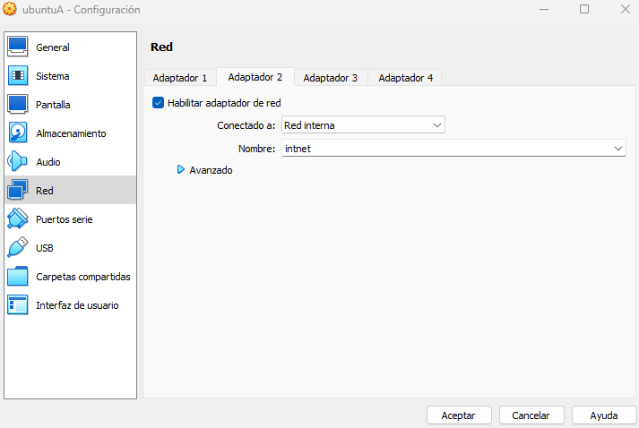
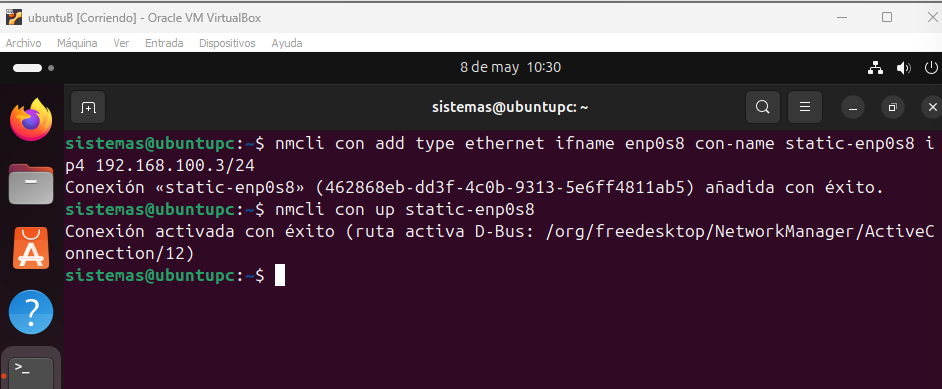

# Configuración de Red en Linux

## 1. Creamos dos máquinas virtuales (clonación enlazada con MAC reinicializada)


### Clonación de las maquinas:
  - Máquina A: `ubuntu-A`
    
  

      
  - Máquina B: `ubuntu-B`

  
  

### Configuración del segundo adaptador:
En las dos máquinas:
- Configuramos el **Adaptador 2** en **Red interna**.
- Nombre de la red: `intnet`.




---

## 2. Configuración de las interfaces `enp0s8` con IPs estáticas (no permanentes)

### Asignación de IP:
- Red: `192.168.100.0/24`
- Máquina A: `192.168.100.2`


- Máquina B: `192.168.100.3`

---

## 3. Comprobación de la conectividad

### Desde la máquina A:
```bash
ping 192.168.100.3
```


### Desde la máquina B:
```bash
ping 192.168.100.2
```


---

## 4. Configuración persistente

### En la máquina A:
Editamos el archivo de configuración de netplan:
```bash
sudo nano /etc/netplan/01-netcfg.yaml
```


Aplicamos los cambios:
```bash
sudo netplan apply
```


### En la máquina B:
Creamos una conexión estática:
```bash
nmcli con add type ethernet ifname enp0s8 con-name static-enp0s8 ip4 192.168.100.3/24
```

Activamos la nueva conexión con el comando:
```bash
nmcli con up static-enp0s8
```


Lanzamos el siguiente comando para que sea la predeterminada y persistente:
```bash
nmcli con mod static-enp0s8 connection.autoconnect yes
```


Comprobamos la conectividad entre máquinas con el comando ping:


